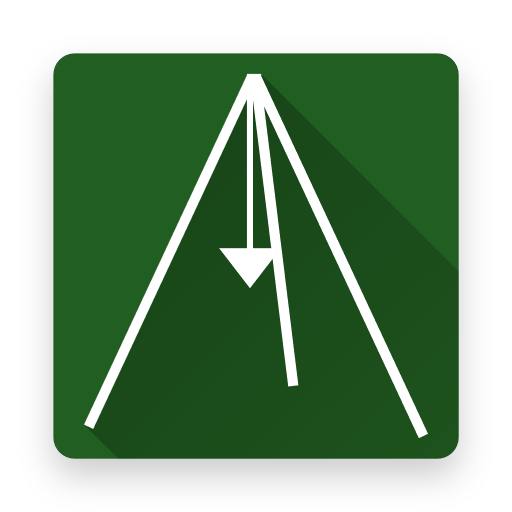

## Shearlegs
.NET software for executing tasks

### Features
* Custom framework for creating tasks in .NET 5
* User friendly web interface
* Versions system based off NuGet.org
* Automatic NuGet dependencies handling
* Basic user accounts system
